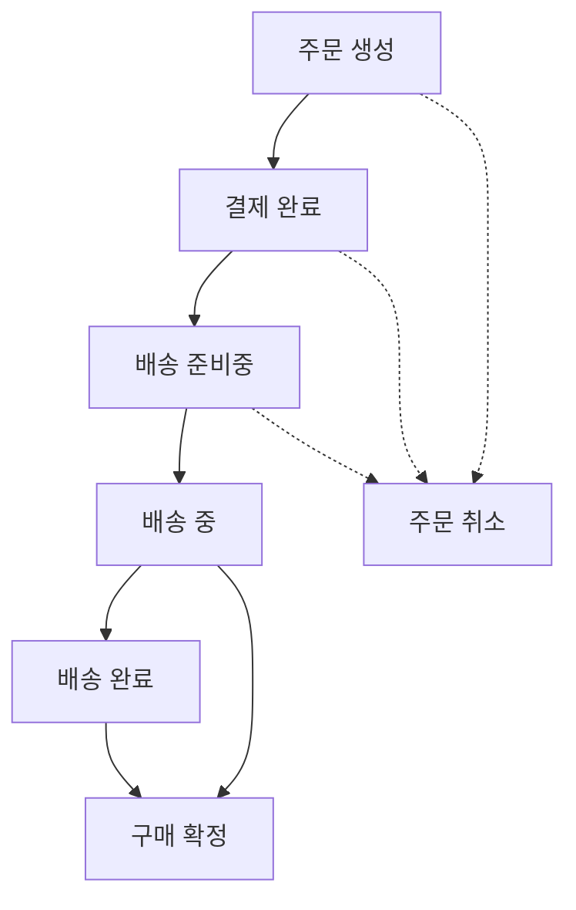

## 1. 왜 주문 시스템을 선택했는가
트랜잭션, 이벤트, 동시성과 같은 백엔드 핵심 주제를 학습할 수 있는 프로젝트를 고민하였다.

CRUD 프로젝트에서도 이러한 문제는 발생할 수 있지만, 주문 시스템은 주문 생성부터 결제, 배송, 취소까지 상태 변화가 명확하게 존재하고 여러 도메인 객체의 데이터 일관성을 유지해야 하는 상황이 발생하기 때문에 해당 주제들을 학습하고 검증하기에 적합하다고 판단하여 주문 시스템을 선택하였다.

또한 주문 시스템은 전자상거래, 배달, 예약 등 다양한 서비스에서 공통적으로 활용되는 대표적인 비즈니스 흐름이다. 덕분에 실제 서비스 사례와 설계 방식을 참고하며 문제를 분석하고 해결 과정을 검증할 수 있다고 판단하였다.

## 2. 상태 흐름 정의

## 3. 상태별 사용자 행동 정리
#### 주문 생성
* 가능
    - 결제하기 [(무통장 입금 X)](#exclude-bank)
    - 주문 취소하기
    - 배송지 변경

* 불가능
    - 구매 확정
    - 배송 조회

#### 결제 완료
* 가능
    - 주문 취소하기
    - 배송지 변경
* 불가능
    - 구매 확정
    
#### 배송 준비중
* 가능
    - [주문 취소하기](#cancel-in-preparing)
    - 배송지 변경
* 불가능
    - 구매 확정

#### 배송 중
* 가능
    - 배송 조회
    - [구매 확정](#confirm-in-shipping)
* 불가능
    - 주문 취소
    - 배송지 변경

#### 배송 완료
* 가능
    - 구매 확정
* 불가능
    - 배송지 변경
    - 주문 취소

#### 구매 확정
* 가능
    - 리뷰 작성 
* 불가능
    - 주문 취소
    - 배송지 변경

#### 주문 취소
* 가능
    - 주문 정보 조회
* 불가능
    - 결제하기
    - 배송지 변경
    - 구매 확정

## 4. 설계 중 고민한 부분
<h3 id="exclude-bank">
1. 무통장 입금 상태를 제외한 이유
</h3>
현재 프로젝트에서는 결제 과정을 단순화하여 모든 결제 수단이 즉시 결제 완료 상태로 전환된다고 가정하였다.

실제 서비스에서는 결제 대기 과정이 필요한 결제 수단(무통장 입금)이 존재하며, 이 경우 별도의 상태와 비즈니스 규칙이 추가되어야 하지만 현재 프로젝트 범위에서는 제외하였다.

<h3 id="cancel-in-preparing">
2. 배송 준비중 상태까지 취소를 허용한 이유
</h3>
배송 준비중 상태까지는 주문 취소를 허용하였다. 실제 서비스에서도 상품 포장 단계까지는 취소가 가능한 경우가 많았다.

<h3 id="confirm-in-shipping">
3. 배송 중 상태에서도 구매 확정을 허용한 이유
</h3>
실제 서비스 이용 중 배송 완료 처리가 지연되었지만 상품은 이미 수령한 경험이 있었다. 따라서 사용자가 상품 수령 여부를 직접 판단할 수 있도록 배송 중 상태에서도 구매 확정을 허용하였다.

